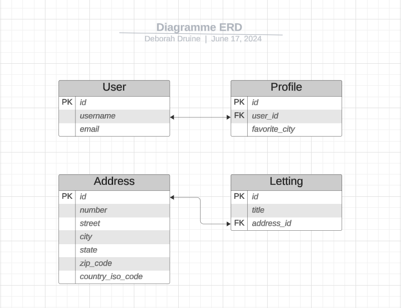

Structure de la base de données et des modèles
==============================================

Diagramme Entité/Relation :

Pour visualiser les relations entre les différents modèles, nous pouvons créer un diagramme entité/relation (ERD). Voici la description des relations :

1. **Profile** a une relation OneToOne avec **User**.
2. **Letting** a une relation OneToOne avec **Address**.

La base de données est structurée comme suit :

- **Profile** : Représente les profils des utilisateurs de l'application. Chaque profil est lié à un utilisateur Django via une relation OneToOne. Un profil contient également une ville préférée.
- **Letting** : Représente les annonces de location. Chaque annonce est associée à une adresse unique via une relation OneToOne.
- **Address** : Contient les adresses des biens immobiliers. Les adresses comprennent le numéro de rue, le nom de la rue, la ville, l'état, le code postal et le code ISO du pays.

.. code-block:: python

    class Address(models.Model):
        """
        Modèle représentant une adresse.
        """
        number = models.PositiveIntegerField(validators=[MaxValueValidator(9999)])
        street = models.CharField(max_length=64)
        city = models.CharField(max_length=64)
        state = models.CharField(max_length=2, validators=[MinLengthValidator(2)])
        zip_code = models.PositiveIntegerField(validators=[MaxValueValidator(99999)])
        country_iso_code = models.CharField(max_length=3, validators=[MinLengthValidator(3)])

    class Letting(models.Model):
        """
        Modèle représentant une location.
        """
        title = models.CharField(max_length=256)
        address = models.OneToOneField(Address, on_delete=models.CASCADE)

    class Profile(models.Model):
        """
        Modèle pour les profils utilisateur.
        """
        user = models.OneToOneField(User, on_delete=models.CASCADE, related_name='profiles_profile')
        favorite_city = models.CharField(max_length=64, blank=True)
