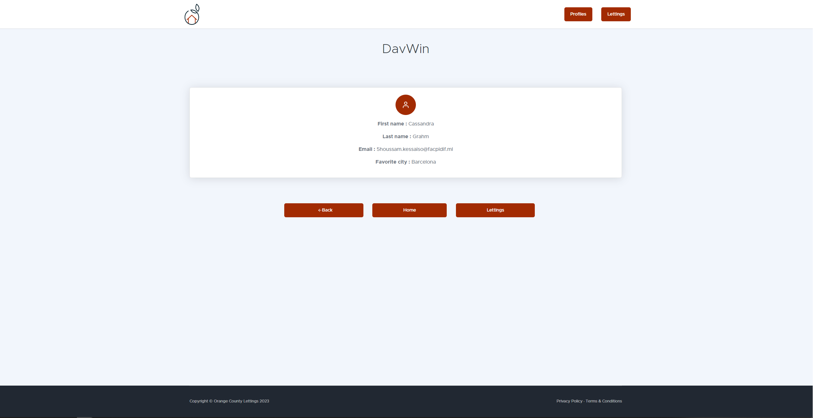

Guide Utilisateur
=================

Ce guide utilisateur explique comment naviguer et utiliser les fonctionnalités de base de l'application. Les captures d'écran illustrent chaque étape.

Page d'accueil
--------------

La page d'accueil vous accueille et vous permet de naviguer vers les différentes sections de l'application.

.. image:: _static/media/001.png
   :alt: Page d'accueil
   :align: center

Index des Profils
-----------------

La page d'index des profils liste tous les profils utilisateurs disponibles. Vous pouvez cliquer sur un profil pour voir plus de détails.

Page de Profil
--------------

Sur la page de profil, vous pouvez voir les informations détaillées d'un utilisateur, comme son nom d'utilisateur et sa ville préférée.

Index des Locations
-------------------

La page d'index des locations liste toutes les annonces de location disponibles. Vous pouvez cliquer sur une annonce pour voir plus de détails.

Page de Location
----------------

Sur la page de location, vous pouvez voir les informations détaillées d'une annonce de location, comme le titre et l'adresse du bien.

.. image:: _static/media/005.png
   :alt: Page de Location
   :align: center

Navigation et Actions
=====================

Naviguer et Utiliser les Profils
--------------------------------

1. Depuis la page d'accueil, cliquez sur le lien vers les profils.
2. Sur la page d'index des profils, cliquez sur un profil pour voir ses détails.

Naviguer et Utiliser les Locations
----------------------------------

1. Depuis la page d'accueil, cliquez sur le lien vers les locations.
2. Sur la page d'index des locations, cliquez sur une annonce pour voir ses détails.

